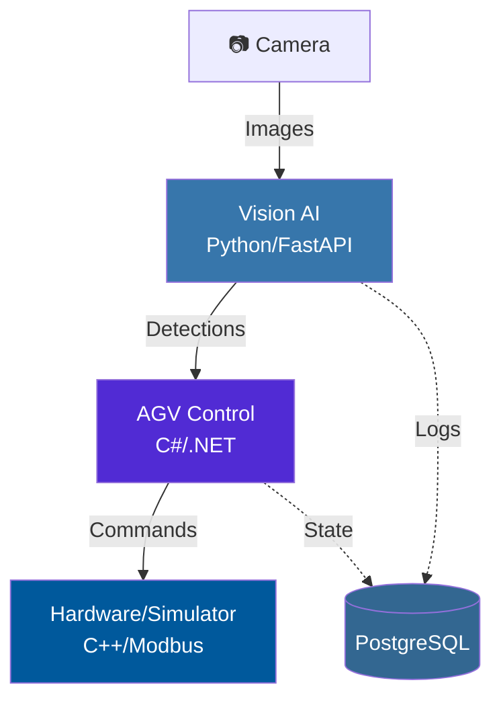

# 🏗️ System Architecture

> **Design Philosophy**: Simple-first, avoid over-engineering. Start with the essentials, scale when needed.

---

## 📐 High-Level Architecture



**Core Principle**: Three independent services communicating via REST APIs and Modbus.

---

## 🔄 Data Flow (Simple Version)

1. **Camera** → Captures image
2. **Vision AI** → Detects objects, returns JSON
3. **AGV Control** → Plans path, sends motor commands
4. **Hardware** → Executes movement
5. **Database** → Logs everything (optional for MVP)

---

## 🧩 Component Breakdown

### 1. Vision AI Controller (Python)

**Purpose**: Process images, detect objects

**Tech Stack**:
- FastAPI (lightweight REST API)
- YOLOv8 (pre-trained model, no custom training needed initially)
- OpenCV (basic image preprocessing)

**Key Endpoints**:
```
POST /detect       # Main detection endpoint
GET  /health       # Health check
```

**Why Simple**:
- Use pre-trained YOLOv8 (no training pipeline needed)
- Single endpoint for detection
- No complex preprocessing initially

---

### 2. AGV Control Server (C#)

**Purpose**: Control robot movement, path planning

**Tech Stack**:
- ASP.NET Core (REST API)
- A* algorithm (simple pathfinding)
- Modbus client (hardware communication)

**Architecture**: 3 layers (not over-engineered)

```
┌─────────────────────────────────┐
│  API Layer                      │  ← REST endpoints
├─────────────────────────────────┤
│  Business Logic                 │  ← Path planning, collision check
├─────────────────────────────────┤
│  Data Access                    │  ← PostgreSQL, Modbus client
└─────────────────────────────────┘
```

**Why Simple**:
- Basic A* (no complex optimization)
- Simple collision avoidance (radius-based)
- Direct Modbus communication (no abstraction layers)

---

### 3. Hardware Simulator (C++)

**Purpose**: Simulate motors for testing (optional for production)

**Tech Stack**:
- libmodbus (Modbus server)
- Simple motor state machine

**Why Simple**:
- Only for development/testing
- Basic state simulation (position, speed)
- No physics engine needed

---

### 4. Database (PostgreSQL)

**Purpose**: Store robot state, task history, vision data, and logs

**Schema** (based on init.sql):
```sql
-- Core tables
robots              # Robot configuration and status
vision_detections   # AI detection results with JSONB
navigation_paths    # Path planning history
task_queue          # Task management with priority
system_logs         # Centralized logging
```

**Key Features**:
- **JSONB columns** for flexible data (detected_objects, waypoints, task_data)
- **Smart indexes** (partial indexes for active robots, low battery alerts)
- **UUID primary keys** for distributed systems
- **Enums via CHECK constraints** (status, log_level)

**Why This Design**:
- JSONB avoids over-normalization for dynamic data
- Partial indexes reduce index size
- Separate tables for clear concerns (not one giant table)

---

## 🔌 Communication Protocols

### REST API (Vision ↔ AGV)

```http
# AGV calls Vision API
POST http://vision-service:8000/detect
Content-Type: multipart/form-data

Response:
{
  "objects": [{"type": "obstacle", "x": 100, "y": 200}]
}
```

**Why REST**:
- Simple HTTP calls
- Easy to test (curl, Postman)
- No message queue complexity

---

### Modbus TCP (AGV ↔ Hardware)

```
AGV Control ──[Modbus TCP]──> Motor Controller
            (IP: 192.168.1.10, Port: 502)
```

**Why Modbus**:
- Industrial standard
- Simple read/write registers
- No custom protocol needed

---

## 🚀 Deployment (Simple)

### Development
```bash
docker-compose up
```

**Services**:
- `vision-ai`: Port 8000
- `agv-control`: Port 5000
- `postgres`: Port 5432

### Production (Start Simple)
- Single server with Docker Compose
- No Kubernetes initially
- Add load balancer only when needed

---

## 📊 Monitoring (Essential Only)

**What to Monitor**:
- ✅ Service health (up/down)
- ✅ API response time
- ✅ Detection accuracy (log only)

**What to Skip Initially**:
- ❌ Complex metrics (Prometheus)
- ❌ Distributed tracing
- ❌ Custom dashboards

**Simple Approach**:
```bash
# Health checks
curl http://localhost:8000/health
curl http://localhost:5000/health
```

---

## 🔐 Security (Basics)

**MVP Security**:
- API keys for service-to-service calls
- HTTPS in production
- Database password in `.env`

**Skip Initially**:
- OAuth/JWT (unless multi-user)
- Rate limiting (add when needed)
- Complex firewall rules

---

## 📈 Scaling Strategy (When Needed)

### Current (Simple)
```
[Vision] ──> [AGV] ──> [Hardware]
    ↓          ↓
      [PostgreSQL]
```

### Future (If Load Increases)
```
[Load Balancer]
    ├──> [Vision 1]
    ├──> [Vision 2]
    └──> [Vision 3]
            ↓
        [AGV Cluster]
            ↓
        [PostgreSQL Primary]
            ↓
        [PostgreSQL Replica]
```

**Scale When**:
- Vision API > 100 req/s
- Database queries > 50ms
- Multiple AGVs (>5 robots)

---

## 🛠️ Technology Choices (Justified)

| Component | Technology | Why Not Alternatives? |
|-----------|------------|----------------------|
| Vision API | FastAPI | Simpler than Django, faster than Flask |
| AGV Control | C# .NET | Strong typing, good for industrial apps |
| Database | PostgreSQL | Reliable, good SQL support (vs NoSQL complexity) |
| Containerization | Docker | Standard, easy to use (vs Kubernetes overhead) |

---

## 🧪 Testing Strategy (Pragmatic)

**What to Test**:
- ✅ Unit tests for core logic (path planning, detection)
- ✅ Integration tests for APIs
- ✅ Manual testing for hardware

**What to Skip Initially**:
- ❌ 100% code coverage
- ❌ Load testing (until production)
- ❌ Chaos engineering

---

## 🚧 Common Pitfalls to Avoid

### ❌ Over-Engineering
```python
# DON'T: Complex abstraction
class AbstractVisionProcessorFactory:
    def create_processor(self, type: ProcessorType):
        ...

# DO: Simple function
def detect_objects(image):
    return yolo_model.predict(image)
```

### ❌ Premature Optimization
```csharp
// DON'T: Complex caching before needed
public class CachedPathPlanningService { ... }

// DO: Simple implementation first
public List<Point> PlanPath(Point start, Point goal) {
    return AStar.FindPath(start, goal);
}
```

### ❌ Too Many Layers
```
# DON'T: 7-layer architecture
API → Service → Manager → Handler → Repository → DAO → DB

# DO: 3 layers
API → Service → Repository
```

---

## 📝 Design Decisions

### Why Microservices (But Simple Ones)?
- **Vision** and **AGV Control** have different scaling needs
- Can deploy independently
- Different tech stacks (Python vs C#)

### Why Not Monolith?
- Harder to scale vision processing separately
- Mixed Python/C# codebase complexity

### Why Not Full Microservices (10+ services)?
- Over-engineering for current scale
- More operational complexity
- Start with 2-3 services, split later if needed

---

## 🔄 Evolution Path

### Phase 1: MVP (Current)
- Basic detection
- Simple path planning
- Single robot

### Phase 2: Production Ready
- Add monitoring (Grafana)
- Improve error handling
- Add logging

### Phase 3: Scale (If Needed)
- Multiple robots
- Load balancing
- Advanced algorithms

**Key Principle**: Build Phase 1 well, don't jump to Phase 3.

---

## 📚 Related Documentation

- [PROJECT_STRUCTURE.md](./PROJECT_STRUCTURE.md) - Detailed file structure
- [DATABASE_SCHEMA.md](./DATABASE_SCHEMA.md) - Database design
- [README.md](../README.md) - Quick start guide

---

## 💡 Key Takeaways

1. **Start simple** - 3 services, REST APIs, basic algorithms
2. **Avoid abstraction** - Write straightforward code first
3. **Scale when needed** - Don't optimize prematurely
4. **Use standards** - REST, Modbus, PostgreSQL (not custom protocols)
5. **Test essentials** - Core logic, not 100% coverage

---

**Remember**: The best architecture is the simplest one that solves the problem. Add complexity only when you have a concrete reason.
