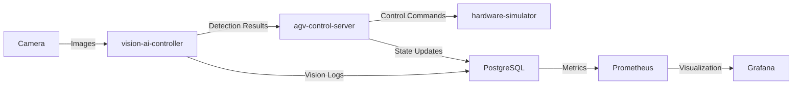

# 📁 Project Structure

This document provides a detailed explanation of the Robot Vision Control System's directory structure and the purpose of each component.

---

## 🌳 Directory Tree

```
robot-vision-control-system/
│
├── README.md                          # ⭐ Project showcase and quick start guide
├── docker-compose.yml                 # Production-ready multi-container deployment
├── .github/workflows/ci-cd.yml        # Automated CI/CD pipeline
│
├── docs/                              # 📚 Documentation
│   ├── ARCHITECTURE.md                # System design and data flow diagrams
│   ├── DATABASE_SCHEMA.md             # PostgreSQL database design
│   ├── AI_MODEL_PERFORMANCE.md        # AI model benchmarks and metrics
│   └── PROJECT_STRUCTURE.md           # This file
│
├── vision-ai-controller/              # 🤖 AI Vision Processing Module (Python)
│   ├── Dockerfile                     # Container configuration for vision service
│   ├── requirements.txt               # Python dependencies
│   ├── src/
│   │   ├── main.py                    # FastAPI server entry point
│   │   ├── deep_learning/             # AI/ML models
│   │   │   ├── yolo_detector.py       # YOLOv8 object detection
│   │   │   ├── custom_cnn.py          # Custom CNN architecture
│   │   │   └── model_inference.py     # Model prediction engine
│   │   ├── image_processing/          # Computer vision utilities
│   │   │   ├── preprocessing.py       # OpenCV image filters
│   │   │   ├── calibration.py         # Camera calibration algorithms
│   │   │   └── quality_check.py       # Image quality validation
│   │   └── api/
│   │       └── vision_endpoints.py    # REST API endpoints
│   └── tests/
│       ├── test_detection_accuracy.py # Model accuracy tests
│       └── benchmark_fps.py           # Performance benchmarking
│
├── agv-control-server/                # 🚗 AGV Control Software (C# .NET)
│   ├── AGVControlServer.sln           # Visual Studio solution file
│   ├── Dockerfile                     # Container configuration for AGV service
│   ├── src/
│   │   ├── AGV.API/                   # 🌐 ASP.NET Core Web API Layer
│   │   │   ├── Controllers/
│   │   │   │   ├── VisionIntegrationController.cs  # Vision API integration
│   │   │   │   ├── PathPlanningController.cs       # Route planning endpoints
│   │   │   │   └── RobotStatusController.cs        # Real-time status API
│   │   │   └── Program.cs             # Application entry point
│   │   │
│   │   ├── AGV.Core/                  # 💼 Business Logic Layer
│   │   │   ├── Services/
│   │   │   │   ├── PathPlanningService.cs          # A* pathfinding implementation
│   │   │   │   ├── CollisionAvoidanceService.cs    # Obstacle detection logic
│   │   │   │   ├── ModbusCommunicationService.cs   # Modbus TCP/RTU protocol
│   │   │   │   └── VisionDataProcessingService.cs  # Vision data handler
│   │   │   ├── Algorithms/
│   │   │   │   ├── AStarPathfinding.cs             # A* algorithm
│   │   │   │   └── DynamicWindowApproach.cs        # DWA for local planning
│   │   │   └── Models/                # Domain models and DTOs
│   │   │
│   │   └── AGV.Infrastructure/        # 🗄️ Data Access Layer
│   │       ├── Database/
│   │       │   ├── AppDbContext.cs    # Entity Framework Core context
│   │       │   ├── Migrations/        # Database migrations
│   │       │   └── Repositories/
│   │       │       ├── RobotStateRepository.cs     # Robot state CRUD
│   │       │       └── TaskQueueRepository.cs      # Task management
│   │       └── ExternalServices/
│   │           └── VisionAPIClient.cs # HTTP client for vision service
│   │
│   └── tests/
│       ├── AGV.Tests/                 # Unit tests (xUnit/NUnit)
│       └── AGV.IntegrationTests/      # Integration tests
│
├── hardware-simulator/                # ⚙️ Hardware Simulation (C++)
│   ├── CMakeLists.txt                 # CMake build configuration
│   ├── src/
│   │   ├── main.cpp                   # Simulator entry point
│   │   ├── modbus_server.cpp          # Modbus server (libmodbus)
│   │   └── motor_controller.cpp       # Motor control simulation
│   └── include/                       # Header files
│
├── database/                          # 🗃️ PostgreSQL Database
│   ├── init.sql                       # Initial database schema
│   ├── migrations/                    # Version-controlled schema changes
│   │   ├── V1__initial_schema.sql
│   │   └── V2__add_vision_logs.sql
│   └── stored_procedures/
│       └── calculate_optimal_path.sql # Advanced SQL for path optimization
│
├── monitoring/                        # 📊 Observability Stack
│   ├── grafana/
│   │   └── dashboards/
│   │       ├── agv_performance.json   # AGV metrics dashboard
│   │       └── vision_accuracy.json   # AI model performance
│   └── prometheus/                    # Metrics collection config
│
└── scripts/                           # 🛠️ Utility Scripts
    ├── benchmark_vision_fps.py        # Vision processing FPS test
    ├── test_db_performance.sql        # Database performance testing
    └── demo_agv_path.py               # Path planning demonstration
```

---

## 📦 Module Descriptions

### 1. **vision-ai-controller/** (Python + FastAPI)

**Purpose**: Real-time image processing and AI-based object detection for AGV navigation.

**Key Technologies**:
- **FastAPI**: High-performance REST API
- **YOLOv8**: State-of-the-art object detection
- **OpenCV**: Image preprocessing and calibration
- **PyTorch/TensorFlow**: Deep learning inference

**Responsibilities**:
- Process camera feeds from AGV
- Detect obstacles, markers, and navigation points
- Provide real-time detection results via REST API
- Log detection events to PostgreSQL

**API Endpoints**:
- `POST /api/vision/detect` - Object detection
- `POST /api/vision/calibrate` - Camera calibration
- `GET /api/vision/health` - Service health check

---

### 2. **agv-control-server/** (C# .NET Core)

**Purpose**: Core AGV control logic, path planning, and hardware communication.

**Architecture**: Clean Architecture (3-layer)

#### **AGV.API** (Presentation Layer)
- ASP.NET Core Web API
- RESTful endpoints for AGV control
- Real-time WebSocket connections
- Swagger/OpenAPI documentation

#### **AGV.Core** (Business Logic Layer)
- **Path Planning**: A* algorithm for global path planning
- **Collision Avoidance**: Dynamic Window Approach (DWA)
- **Modbus Communication**: Industrial protocol for motor control
- **Vision Integration**: Processes data from vision-ai-controller

#### **AGV.Infrastructure** (Data Access Layer)
- **Entity Framework Core**: ORM for PostgreSQL
- **Repository Pattern**: Data access abstraction
- **HTTP Clients**: Communication with external services

**Key Features**:
- Real-time robot state management
- Task queue processing
- Fault tolerance and retry logic
- Performance logging and metrics

---

### 3. **hardware-simulator/** (C++)

**Purpose**: Simulate AGV hardware (motors, sensors) for development and testing.

**Key Technologies**:
- **libmodbus**: Modbus TCP/RTU server
- **CMake**: Cross-platform build system
- **C++17**: Modern C++ features

**Use Cases**:
- Test AGV control logic without physical hardware
- Simulate motor responses and sensor data
- Validate Modbus communication protocol

---

### 4. **database/** (PostgreSQL)

**Purpose**: Centralized data storage for robot states, tasks, and vision logs.

**Schema Design**:
- `robots` - AGV configuration and status
- `tasks` - Task queue and execution history
- `vision_logs` - Detection results and image metadata
- `path_history` - Historical path data for analysis

**Advanced Features**:
- Stored procedures for complex queries
- Triggers for automatic logging
- Indexes for high-performance queries
- Flyway/Liquibase migrations

---

### 5. **monitoring/** (Grafana + Prometheus)

**Purpose**: Real-time monitoring and visualization of system metrics.

**Metrics Tracked**:
- Vision processing FPS
- Detection accuracy
- AGV position and velocity
- Database query performance
- API response times

**Dashboards**:
- **AGV Performance**: Speed, battery, task completion rate
- **Vision Accuracy**: Precision, recall, F1-score

---

## 🔄 Data Flow



---

## 🚀 Deployment

### Development
```bash
# Start all services
docker-compose up -d

# Access services
# Vision API: http://localhost:8000
# AGV API: http://localhost:5000
# Grafana: http://localhost:3000
```

### Production
- **Kubernetes**: Orchestration with Helm charts
- **CI/CD**: GitHub Actions for automated testing and deployment
- **Monitoring**: Prometheus + Grafana stack

---

## 🧪 Testing Strategy

| Module | Test Type | Tools |
|--------|-----------|-------|
| vision-ai-controller | Unit + Integration | pytest, unittest |
| agv-control-server | Unit + Integration | xUnit, Moq |
| hardware-simulator | Unit | Google Test |
| database | Performance | pgbench, custom SQL |

---

## 📝 Development Guidelines

### Adding New Features

1. **Vision AI**: Add models to `vision-ai-controller/src/deep_learning/`
2. **AGV Logic**: Implement services in `AGV.Core/Services/`
3. **Database**: Create migration in `database/migrations/`
4. **Tests**: Write tests before implementation (TDD)

### Code Style

- **Python**: PEP 8, Black formatter
- **C#**: Microsoft C# Coding Conventions
- **C++**: Google C++ Style Guide
- **SQL**: PostgreSQL naming conventions

---

## 🔗 Related Documentation

- [ARCHITECTURE.md](./ARCHITECTURE.md) - System architecture and design patterns
- [DATABASE_SCHEMA.md](./DATABASE_SCHEMA.md) - Database schema details
- [AI_MODEL_PERFORMANCE.md](./AI_MODEL_PERFORMANCE.md) - AI model benchmarks
- [README.md](../README.md) - Project overview and quick start

---

## 📧 Contact

For questions about the project structure, please refer to the main [README.md](../README.md) or open an issue on GitHub.

---

**Last Updated**: February 2026  
**Maintained By**: Development Team
